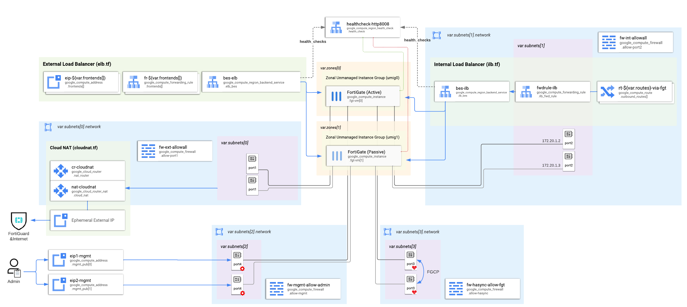

# FortiGate Terraform module:
## HA Active-Passive cluster (FGCP in load balancer sandwich)



This terraform module can be used to deploy the base part of FortiGate reference architecture consisting of:
- 2 FortiGate VM instances - preconfigured in FGCP Active-Passive cluster
- zonal instance groups to be used later as components of backend services
- internal load balancer resources in trusted (internal) network
- backend service in external network (load balancer without frontends)
- (optionally) external IP addresses and ELB frontends (forwarding rules)
- cloud firewall rules opening ALL communication on untrusted and trusted networks
- cloud firewall rules allowing cluster sync and administrative access
- static external IP addresses for management bound to nic3 (port4) of FortiGates
- Cloud NAT to allow traffic initiated by FGTs out
- (optionally) Secret Manager secret with FGT API token

### How to use this module
We assume you have a working root module with proper Google provider configuration. If you don't - start by reading [Google Provider Configuration Reference](https://registry.terraform.io/providers/hashicorp/google/latest/docs/guides/provider_reference).

1. Create before you start (or define in your root terraform module) 4 VPC networks with one subnet in each. All subnets must be in the region where you want to deploy FortiGates and their CIDRs cannot overlap
1. Copy license files (*.lic) to the root module folder if you plan to deploy BYOL version. If using BYOL version you also have to change the `image_family` or `image_name` variable (see [examples/licensing-byol](./examples/licensing-byol) for details)
1. Reference this module in your code (eg. main.tf) to use it, eg.:
    ```
    module "fgt-ha" {  
      source = "git::github.com/fortinet/terraform-google-fgt-ha-ap-lb"  
    }
    ```
1. In the above module block provide the variables described in `variables.tf`. Only 2 variables are obligatory:
    - `region` - name of the region to deploy to (zones will be selected automatically); it also indicates subnets to use
    - `subnets` - list of 4 names of subnets already existing in the region to be used as external, internal, heartbeat and management networks.

    but you might want to provide values also to some others:
    - `zones` - list of 2 zones for FortiGate VMs. Always match these to your production workloads to avoid [inter-zone traffic fees](https://cloud.google.com/vpc/network-pricing). You can skip for proof-of-concept deployments and let the module automatically detect zones in the region.
    - `license_files` - list of paths to 2 license (.lic) files to be applied to the FortiGates. If skipped, VMs will be deployed without license and you will have to apply them manually upon first connection. It is highly recommended to apply BYOL licenses during deployment.
    - `prefix` - prefix to be added to the names of all created resources (defaults to "**fgt**")
    - `labels` - map of [Google Cloud labels](https://cloud.google.com/compute/docs/labeling-resources) to be applied to VMs, disks and forwarding rules
    - `admin_acl` - list of CIDRs allowed to access FortiGates' management interfaces (defaults to [0.0.0.0/0])
    - `machine-type` - type of VM to use for deployment. Defaults to **e2-standard-4** which is a good (cheaper) choice for evaluation, but offers lower performance than n2 or c2 families.
    - `image_family` or `image_name` - for selecting different firmware version or different licensing model. Defaults to newest 7.2 image with PAYG licensing (fortigate-72-payg)
    - `frontends` - list of names to be used to create ELB frontends and EIPs. By default no frontends are created. Resource names will be prepended with the `var.prefix` and resource type.
1. Run the deployment using the tool of your choice (eg. `terraform init; terraform apply` from command line)

Examples can be found in [examples](examples) directory.

### Licensing
FortiGates in GCP can be licensed in 3 ways:
1. [PAYG](examples/licensing-payg) - paid per each hour of use via Google Cloud Marketplace after you deploy. This is the default setting for this module and you don't need to change anything to use it.
2. [BYOL](examples/licensing-byol) - pay upfront via Fortinet Reseller. You will receive the license activation code, which needs to be registered in [Fortinet Support Portal](https://support.fortinet.com). After activation you will receive **.lic** license files which you need to add to your terraform deployment code and reference using `license_files` input variable. You will also need to change the `image_family` or `image_name` variable to a byol image.
3. [FortiFlex (FlexVM)](examples/licensing-flex) - if you have an Enterprise Agreement with Fortinet and use FortiFlex portal, you will have to change the deployed image to BYOL. License tokens can be passed to the module using `flexvm_tokens` variable. Note that tokens cannot be re-used. If you need to re-deploy cluster with the same licenses you need to regenerate tokens in FlexVM portal.

### Connecting to management interface
After deployment you can access management interfaces of both instances directly through their public management addresses listed in `fgt_mgmt_eips` module output. By default you can access management interfaces from any network, but the access can (and should!) be restricted by using the `admin_acl` module variable. The initial password is set to the instance id of the primary fortigate (listed in module output `fgt_password`) and you will have to change it upon first login.

### Configuration
* [External IP addresses](examples/public-addresses-elb-frontend)
* [Using ARM-based machine type (T2A family)](examples/arm-based-machine-type)
* [Selecting proper boot image](docs/images.md)
* [GVNIC driver and custom images](examples/gvnic-custom-image)

### Customizations
1. all addresses are static but picked automatically from the pool of available addresses for a given subnet. modify addresses.tf to manually indicate addresses you want to assign.
